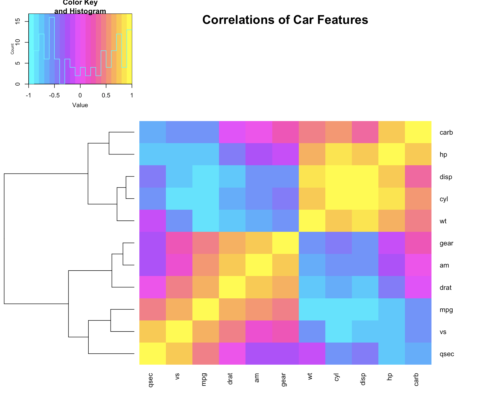
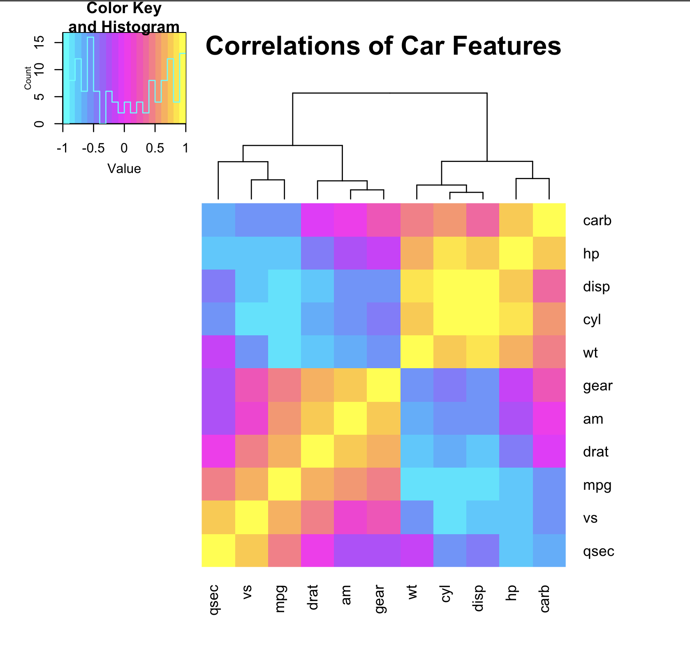

This package was designed for scientists to create beautiful and publishable graphs without needing to learn the ins and outs of coding graphs in R. While these functions were created with astronomy, neuroscience, and psychology in mind, they can be used in any fields.

```{r, include = FALSE}
knitr::opts_chunk$set(
  collapse = TRUE,
  comment = "#>"
)
```

```{r setup, warning = F, message = F}
library(SciViz)
```

## APA Regulation Ready Graphs

### APA Line Graph
The apa_line() function is designed to create a line chart that adheres to APA 7th edition style guidelines, using ggplot2 for data visualization. It includes options for adding error bars to represent variability in the data, along with customizable titles, labels, and colors, making it ideal for producing professional and publication-ready line charts in academic contexts.

```{r}
data("lineData1")
apa_line(
   data = lineData1,
   x_var = "Time",
   y_var = "Value",
   group_var = "Group",
   error_var = "Error",
   title = "Example Line Chart with Error Bars",
   subtitle = "Following APA 7th Edition Guidelines",
   x_label = "Time (Units)",
   y_label = "Values"
 )
```


### APA Bar Graph
The apa_bar() function is designed to create a bar graph that follows APA 7th edition style guidelines using ggplot2 in R. It provides customizable options for adding error bars, titles, labels, groupings, and faceting, making it suitable for generating clear, publication-ready bar charts for academic presentations and publications.

Example 1: Depression Scores by Treatment Groups
```{r}
apa_bar(
   data = barData1,  # The dataset
   x_var = "Time",  # The time variable (e.g., Day 1, Day 2, etc.)
   y_var = "Depression_Scores",  # The response variable (e.g., Depression scores)
   group_var = "Group",  # The grouping variable (e.g., Control vs. Treatment)
   error_var = "Error_Values",  # The error variable
   title = "Depression Scores Over Time",  # Main title
   subtitle = "Comparison Between Control and Treatment Groups",  # Subtitle for context
   x_label = "Days",  # x-axis label
   y_label = "Depression Scores",  # y-axis label
   bar_color = c("black", "darkgrey"),  # Custom bar colors for the two groups
   legend_title = "Group"  # Legend title
)
```

This example visualizes depression scores over time for two treatment groups (Control vs. Treatment), including error bars to represent the variability in the data. The bar colors differentiate the groups, and the chart includes a clear title, subtitle, and axis labels, making it suitable for a publication.

Example 2: Imbalanced Sample (Exercise Duration)

```{r}
apa_bar(
   data = barData2,
   x_var = "Activity",
   y_var = "Mean_Duration",
   group_var = "Session_Type",
   error_var = "Error_Value",  # Specify the error variable
   title = "Average Exercise Duration by Activity",
   subtitle = "Comparison of Weekday and Weekend Sessions",
   x_label = "Activity Type",
   y_label = "Mean Duration (minutes)",
   bar_color = c("black", "darkgrey"),  # Different custom colors for groups
   legend_title = "Type"
 )
```

This example uses an imbalanced dataset to illustrate that the apa_bar() function may not be suitable for visualizing imbalanced data. In this case, the number of sessions varies across activity types, which could distort the representation of the data in the bar chart. Consequently, this function is not ideal for situations where sample sizes are unequal across groups, as it may lead to misleading visual interpretations.

A more detailed breakdown: 
The dataset includes three activities: Running, Swimming, and Cycling. Each activity has four corresponding rows, resulting in a total of 12 rows in the dataset. The Session_Type variable, which indicates whether the session occurred on a Weekday or Weekend, repeats six times for each activity. However, this creates an imbalance in the representation of sessions across the different activities. Specifically, while there are six Weekend sessions for each activity type, there are only four Weekday sessions for each activity type. This discrepancy leads to an unequal distribution of sessions across the activity types. As a result, this imbalance between activities means that the bar chart will not represent the activities equally. In particular, the number of sessions for each activity type differs, which could lead to misleading visualizations. This imbalance is a key factor that might make the bar chart less effective for this specific scenario, as it may not accurately reflect the true distribution of sessions across activities.


## Network Plots and Heatmaps

### Network Plot

Network plots are ..... Network plots use matrices containing points with directionality. This means for each (x,y) pair, there is an "inital" point and a "target" point. They are often used for ..........

Network plots are used in neuroscience in a variety of ways, corresponding with a variety of different ways of analyzing the data. In neuroscience, there are numerous types of matrices used in network plots for neuroscience research, but some common ones are [adjacency](https://www.sciencedirect.com/science/article/pii/B9780124079083000030) and [Laplacian matrices](https://www.frontiersin.org/journals/computational-neuroscience/articles/10.3389/fncom.2013.00189/full). Adjacency matrices are used in neuroscience to represent the pattern of connectivity between nodes in the brain. Degree matrices are used to describe the number of nodes connected to each node in a network. Lapacian matrices are used in neuroscience to study neural networks and brain connectivity. 

 


This image shows a network visualized as a regular network, small-world network, and random network.[Source](https://www.cell.com/trends/cognitive-sciences/fulltext/S1364-6613%2817%2930221-8)


This graph shows an example of a network plot depicting differences in brain connectivity in control vs schizophrenia patients. [Source](https://www.nature.com/articles/nrn2575)

Along with different types of matrices, there are also many different ways to visualize the corresponding data. Lapacian matrices are complex and graphing them is out of the scope of this function. For resources on graphing lapacian matrices check out the [iGraph](https://rdrr.io/cran/igraph/) package and its [lapacian_matrix](https://rdrr.io/cran/igraph/man/laplacian_matrix.html) function. The iGraph documentation aslo has information on the [structural properties of graphs](https://igraph.org/c/html/latest/igraph-Structural.html#igraph_get_laplacian) and [degree and degree distribution of vertices](https://igraph.org/r/html/1.2.3/degree.html). For graphing adjacency matrices for your specific needs, check out the [iGraph](https://rdrr.io/cran/igraph/) package's [graph_from_adjacency_matrix](https://www.rdocumentation.org/packages/igraph/versions/1.3.5/topics/graph_from_adjacency_matrix) function. 

The `interact_network_plot` function is designed to allow researchers to perform exploratory data analysis of data in edge list format. This will allow them to determine what the most efficient way of analyzing and manipulating their data. The `interact_network_plot` uses R packages [iGraph](https://rdrr.io/cran/igraph/) and [networkD3](https://christophergandrud.github.io/networkD3/).

#### Arguments
Only one argument is necessary, `data`, a matrix or a data frame of edge list format. In congruence with the networkD3 package, it should be of the form 
`initial_pt`: The column NUMBER of initial point variable. Default is 1 

`target_pt`: The column NUMBER of target point variable. Default is 2

`linkDistance`: The numeric distance between the links in pixels. Default is 10.

`linkColour`: A character string specifying the colour you want the link lines to be. Multiple formats supported (e.g. hexadecimal). Default is "#666".

`nodeColour`:	A character string specifying the colour you want the node circles to be. Multiple formats supported (e.g. hexadecimal). Default is "#69b3a2". 

`opacity`: Numeric value of the proportion opaque you would like the graph elements to be. Default is 0.9

`zoom`: A logical value to enable (TRUE) or disable (FALSE) zooming. Default is TRUE

`title`: A character string: title for graph. Default is "Network Graph".

`subtitle`: A character string: subtitle for graph. Smaller, lighter text than title. Default is "Exploring Interactions and Relationships".


#### Result
An interactive simple network graph with title and subtitle.

If you want to save the graph by itself as a stand alone html file, you can run the following code.
```{r}
library(dplyr)
library(magrittr)
library(networkD3)
simpleNetwork(network_data_test) %>%
saveNetwork(file = 'Net1.html')
```

#### How to use the **interact_network_plot** function

Because the nuance of data structure and analyses that come with neuroscience data, this package is designed to allow researchers to explore the structure of their data. This exploratory analysis could yield information for the most efficient and accurate way to statistically analyze and visualize the specific data structure of the current project. It is not designed to make publication-ready graphs. 

more info on function itself....
might make different matrices and want to see difference between them-- adding titles to simple network needs html::tools which is made simple and easy by this function


An example dataset has been provided in this package to explore what the `interact_network_plot` function can do. The dataset, `network_data_test` includes ......

#### How the **interact_network_plot** function works
First, the function creates the interactive network plot using the [simpleNetwork](https://christophergandrud.github.io/networkD3/#simple) function from the [networkD3](https://christophergandrud.github.io/networkD3/) package. 
```{r}
#create network graph
p <- simpleNetwork(network_data_test,
                    Source = 1,                 # column number of source
                    Target = 2,                 # column number of target
                    linkDistance = 10,          # distance between node. Increase this value to have more space between nodes
                    charge = -900,                # numeric value indicating either the strength of the node repulsion (negative value) or attraction (positive value)
                    fontSize = 14,               # size of the node names
                    fontFamily = "serif",       # font og node names
                    linkColour = "#666",        # colour of edges, MUST be a common colour for the whole graph
                    nodeColour = "#69b3a2",     # colour of nodes, MUST be a common colour for the whole graph
                    opacity = .9,              # opacity of nodes. 0=transparent. 1=no transparency
                    zoom = TRUE                    # Can you zoom on the figure?

  )
```

Finally, it adds the title and subtitle using the [htmltools](https://rstudio.github.io/htmltools/) package. 
```{r}
htmlwidgets::prependContent(p,
                            htmltools::tags$div(
                              htmltools::tags$h3("Title",
                                      style = "text-align: center; font-family: serif; color: #333;"),
                              htmltools::tags$h4("Subtitle",
                                      style = "text-align: center; font-family: serif; color: #666;")
                            ))
```


#### Example usage of **interact_network_plot**
```{r, warning = F, message = F}
interact_network_plot(network_data_test, initial_pt = 1, target_pt = 2)
```


```{r, warning = F, message = F}
interact_network_plot(network_data_test, initial_pt = 3, target_pt = 4)
```

#### Notes and Considerations


#### Extra Resources for Using Networks in Neuroscience: 
[Brain Connectivity ToolBox](https://sites.google.com/site/bctnet/list-of-measures) 

[Network Neuroscience Theory of Human Intelligence](https://www.cell.com/trends/cognitive-sciences/fulltext/S1364-6613%2817%2930221-8)


### Heatmaps

Heatmaps use color to graphically represent relationships between many variables or observations. They originated in the 19th century, where scientists would manually draw each "pixel" in grayscale.


Correlation heatmaps are used in neuroscience to illustrate connectivity between brain regions. This is often done by taking electroencephalography data of the brain and consequently plotting time on both axes, with color demonstrating relative correlation values. This is shown in the example below.


This image shows an example of a heatmap of brain regions with time on both axes. It shows the difference in connectivity when on ketamine, midazolam, before falling asleep, and sleeping all compared to controls. The red line along the diagonal demonstrates how each time point is 100% correlated to itself. Electroencephalography data taken in monkeys by [Professor Teichert's Lab](https://www.teichert.pitt.edu/index.html) at Pittsburgh University.

Here is another example of heatmap graph use in analyses of structural and functional systems. [Source](https://www.nature.com/articles/nrn2575)


Unfortunately, the datasets used to make plots like this in real research labs is classified due to regulations about data privacy. So we will use [mtcars](https://www.statology.org/mtcars-dataset-r/) to demonstrate the use of this package's `corrheatmap` function.

#### Arguments

Only one argument is necessary, `data`, a **matrix or a data frame**. The data must be **numeric** in order for correlation values to be calculated.

Optional arguments are `colors`, `n_colors`, `title`, and `dend` for addition of a dendrogram to rows, columns, or both.

`colors`: A vector of 3 colors. The color argument uses the package [grDevices](https://www.rdocumentation.org/packages/grDevices/versions/3.6.2) [colorRampPallete](https://www.rdocumentation.org/packages/grDevices/versions/3.6.2/topics/colorRamp) function, and thus can take a vector of colors in agreement with the valid argumnents of [col2rgb](https://www.rdocumentation.org/packages/grDevices/versions/3.6.2/topics/col2rgb). Colors can be hexadecimal form, color name (as listed by [colors()](), or a positive integer i, meaning palatte()[i]. Defualt is magenta (#ff00ff), cyan (#00ffff), and yellow (#ffff00).

`n_colors`: number of colors to be created in pallate from `colors` argument. Default is 20. Increase for large datasets.

`title`: A string of characters. Default is "Correlation Heatmap".

`dend`: A string; "row", "column", "both", or "none". Default is "both".

This `corrheatmap` function uses the packages [corrplots](https://cran.r-project.org/web/packages/corrplot/vignettes/corrplot-intro.html) and [gplots](https://www.rdocumentation.org/packages/gplots/versions/3.2.0) to create a correlation heatmap for as many numeric variables and observations as the user desires. If using a large dataset, the `n_colors` argument should be increased accordingly.

#### Result

The `corrheatmap` function calculates [Pearson Correlations](https://www.scribbr.com/statistics/pearson-correlation-coefficient/) from a matrix and returns a correlation heatmap in a new Quartz window with a title, color key and histogram, axis labels, and optional dendrograms.

#### How the **corrheatmap** function works

First, the function creates the correlation values to plot. This `corrheatmap` function calculates [Pearson correlation](https://www.scribbr.com/statistics/pearson-correlation-coefficient/) coefficients. The Pearson correlation coefficient is the most common way of measuring a linear correlation. It is a number between –1 and 1 that measures the strength and direction of the relationship between two variables. Between 0 and 1 is a positive correlation, 0 is not correlated, and between -1 and 0 is a negative correlation.

```{r, warning = F, message = F}
library(stats)
data(mtcars)
cor(mtcars)
```

Then, it creates a color palatte from the colors given in the `colors` argument.

```{r, warning = F, message = F}
library(grDevices)
#Default: Cyan, magenta, yellow, and 20 colors in the pallatte 
colorRampPalette(c("#00ffff", "#ff00ff", "#ffff00")) (20)
```

Finally, it creates the graph in a new Quartz window using [grDevices](https://www.rdocumentation.org/packages/grDevices/versions/3.6.2).

```{r, warning = F, message = F}
library(corrplot)
library(gplots)
#library(grDevices)

dev.new()

#create correlation values
c <- cor(mtcars)

#create color palette based on user input or default
color <- colorRampPalette(c("#00ffff", "#ff00ff", "#ffff00")) (20)

#create graph in new window
heatmap.2(c,
          col = color,
          na.rm = TRUE,
          dendrogram = "both",
          key = TRUE,
          symm = TRUE,
          margins = c(10, 10),  #Adjust margins to fit labels
          cexRow = 1,           #Adjust row label size
          cexCol = 1,           #Adjust column label size
          las = 3,              #Angles column labels
          trace = "none",       #Turn off tracing lines
          main = "mtcars Correlation Heatmap")         #Add the title

```

#### Example of Dendrogram Usage

You can specify if you want dendrograms on both the rows and the columns, just the columns, just the rows, or no dendrogram.

Here is an example with dendrograms of both rows and columns.

```{r, warning = F, message = F}
corrheatmap(mtcars, title="Correlations of Car Features", dend="both")
```


Here is an example with a dendrogram of rows.

```{r, warning = F, message = F}
corrheatmap(mtcars, title="Correlations of Car Features", dend="row")
```



Here is an example with a dendrogram of columns.

```{r, warning = F, message = F}
corrheatmap(mtcars, title="Correlations of Car Features", dend="col")
```



Here is an example with no dendrograms.

```{r, warning = F, message = F}
corrheatmap(mtcars, title="Correlations of Car Features", dend="none")
```


#### Notes and Considerations

\*Even with a relatively small dataset such as `mtcars`, when the `dend` argument is specified as "both", the window needed to print the plot is too large for RStudio. The function is set to open a new Quartz window when the function is run, so do not be surprised when nothing pops up in the Plots window in RStudio. The plot will appear in a separate window. This is done using the [grDevices](https://www.rdocumentation.org/packages/grDevices/versions/3.6.2) package's [dev.new](https://www.rdocumentation.org/packages/grDevices/versions/3.6.2/topics/dev) function.

If you have already run the function and run it a second time, sometimes the window is updated to the new graph but is not brought to the front of your screen. If this happens, look for a hidden window behind your other windows.

#### Extra Resources for Using Heatmaps in Neuroscience: 
[What is a heatmap and how do I read it?](https://knowledge.neuronsinc.com/heatmap)

[Neural Datascience Heatmaps](https://neuraldatascience.io/6-single_unit/heat_maps.html)


## Cornerplots and Scatterplots

### Cornerplots

Cornerplots are often used in astronomy to understand the distribution of numeric variables. These are often used to display the results from Markov Chain Monte Carlo (MCMC) simulations, and are used by astronomers to identify if their variables have Gaussian distributions. While those methods are likely familiar to astronomers who may be using this package, even if you aren't sure what an MCMC simulation of a Gaussian distribution is, there are other ways to utilize this package for a better understanding of your data.

Let's look at an example with the dataset from this package, [starcatalog](https://chenning2011.github.io/SciViz/reference/starcatalog.html). This dataset has information on 8774 stars, and we might be interested in seeing the relationships between the numeric variables in this dataset. Here is how you can make a cornerplot, using all of the default settings. You only need to specify a dataset, and the function will create the requested graph.

```{r, warning = F, message = F}
cornerplot(starcatalog)
```

This plotted all of the numeric variables in the dataset, `bv_color`, `parallax`, and `vmag` against each other in both 2d and 1d histograms. The 1d histograms are shown in purple and show only the distribution of the variable on the x-axis, while the 2d histograms show paired distributions for the variables on the x- and y-axes. Here, we can see that parallax is very right-skewed, which is also clear through the 2d histograms it is a part of, clumping the data vertically downwards. We can see that there are possibly some outliers in this data when looking at the combinations of `bv_color` and `parallax`, as there are a few data points with abnormally high parallax, even though they have values in the normal range for `bv_color`. Additionally, we can see how many points fall within each range by using the colorbar next to the 2d histograms. For example, when examining just `bv_color` and `vmag`, there is a high concentration of stars that have a `vmag` value of around six, with a `bv_color` value of around zero.

There are many ways you can customize these plots to make them better suit your needs. For example, if you only want to examine the relationships between two of the variables in starcatalog, you can specify them. You can also remove the countor plot that sits on top of the cornerplot, and change the color of both kinds of histograms. Any [ggplot2 color](https://sape.inf.usi.ch/quick-reference/ggplot2/colour) can be used to change the color of the histograms, and color palette options have been taken from the [colorspace](https://colorspace.r-forge.r-project.org/articles/ggplot2_color_scales.html#available-palettes) package.

```{r}
cornerplot(starcatalog, varlist = c("vmag", "bv_color"), 
           palette = "Blues", fill="dodgerblue3", 
           contour = FALSE)
```

Here, we have changed the graph so that both histograms have a blue fill/palette, only two of the variables are displayed, and the contour has been removed.

Further customization can be achieved through changing the number of bins and contour lines. The default number of bins for the histograms is 30, but can be adjusted down to any number of your choosing. Similarly, the default number of contours is 3. The `bins` parameter adjusts the number of bins in both the 1d and 2d histograms, while the `contourBins` parameter is only used when there is a contour plot on top of the 2d histograms.

```{r}
cornerplot(starcatalog, bins = 50, contourBins = 5)
```

In the example above, it is harder to see the distributions because there are so many bins, so be sure to change the `bins` and `contourBins` parameters until you get a result you are happy with.

### Scatterplots

The scatterplots included in this package have been optimized to work with large datasets, and can be customized to fit your preferences. These plots can be used to look at any two numeric variables and the relationship between them. You must specify the dataset, an x-variable, and a y-variable.

```{r, warning = F, message = F}
scatterplot(starcatalog, x = "vmag", y = "bv_color")
```

In this example, we can see where there are large concentrations of each variable, and the relationship between the two variables. To investigate the variables in the dataset further, you can use a grouping or color variable to identify how this relationship is changed by addding a categorical variable into the mix.

```{r}
scatterplot(starcatalog, "vmag", "bv_color", 
            color = "multiple", palette = "Viridis")
```

Sometimes it can be hard to make out the different colors on this graph, so you can also facet the variable instead of changing the color of the points. Here is an example using the same variable as the graph above.

```{r}
scatterplot(starcatalog, "vmag", "bv_color", 
            group = "multiple", 
            color = "multiple", palette = "Viridis")
```

Now we can see that it was hard to see the multiples of A, R, and I because there were very few stars with these multiples! You do not have to specify both group and color and the points will default to black if no color is specified.

Other customizable features of this graph include changing the `alpha` or the opacity of the points, and the `size` of these points. Both the `size` and the `alpha` default to 0.5. Here is an example of how changing these parameters changes the graph, using the graph that we've been creating. The `color` parameter has been changed to blue4, to make the points easier to see against the white background.

```{r}
scatterplot(starcatalog, "vmag", "bv_color", 
            group = "multiple", color = "blue4", 
            size = 0.2, alpha = 0.8)
```

Here, the points are smaller but also less opaque, which makes each individual point easier to see. Each of these parameters can be customized to your liking, until you have a graph that adequately displays all of the information you want to capture.
